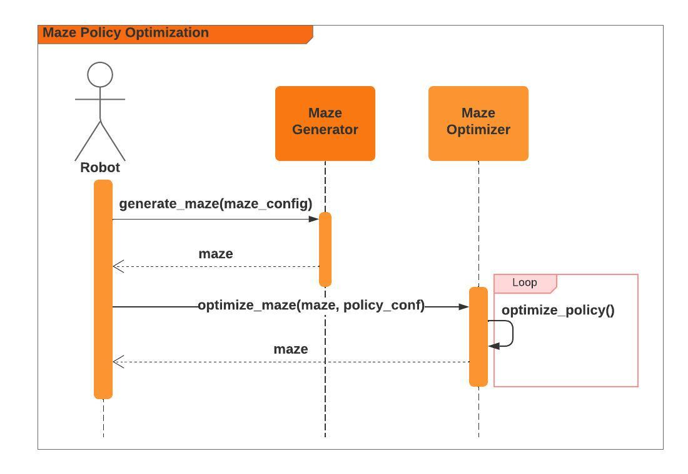

<!-- ABOUT THE PROJECT -->

## About The Project

To gain a thorough understanding of the working of a robot that is implemented as a
reinforcement learning agent. The robot needs to navigate in a grid that contains obstacles. The robot
can start in any position along the grid that is either not a position occupied by an obstacle or is not the
destination. Both obstacles and the destination position are fixed and indicated in the grid.
<br>
<br>


<!-- Design -->
## Agent Architecture

This project will utilize a model-free, utility-based agent.  The agent will not have a model like some of the traditional search informed heuristics algorithms.  But, rather it will be implemented using a Machine Learning (ML) sub-problem of the Reinforcement Learning (RL) archetype.  In particular, the agent will implement an Markov Decision Processes (MDP) known as value iteration thereby implementing a Value Iteration Policy (VIP) algorithm.  The VIP for this particular algorithm is a fully observable stochastic process.  MDP, in general, is a decision problem where a series of sequential decisions utilize a Markovian transition model and additive rewards system to reach some ultimate goal.  As a factored representation, MDP consists of "a set of states (with an initial state s0); and a is ∈ A(s) or set of actions in each state; a probabilistic transition model  where  is ∈ S or set of future state, s is ∈ S or set of previous states; and a reward function ".  

This MDP will be implemented using dynamic programming (DP) thereby "recursively breaking the [problem down] into smaller pieces and remembering the optimal solutions to the pieces."

This particular problem will implement a non-stationary policy that depends on the passage of time with no fixed time limit.  However, as we will see the policy algorithm will terminate based on specific conditions that are met.  As utility-based agent we will calculate the utility through a state of sequences using additive discounted rewards.  The utility of history of sequences is defined as:


where ɣ is a floating point number between 0 and 1.


<b>Table 1 - Artificial Intelligence (A.I.) Project Archetype</b>

| Type                       | Sub Type                        | Algorithm                    |
|----------------------------|---------------------------------|------------------------------|
| Reinforcement Leaning (RL) | Markov Decision Processes (MDP) | Value Iteration Policy (VIP) |


<p align="right">(<a href="#readme-top">back to top</a>)</p>


<!-- Design -->
## High-level Agent Design
The system is designed exclusively with model objects such as the robot, maze configuration, maze generator, policy configuration, and maze policy.

<b>Table 1 - System (Agent/Environmental) Component Descriptions</b>

| Component            | Description                                                                                                                                                                                                                                                                                                                                                                                                                                                                                                 | 
|----------------------|-------------------------------------------------------------------------------------------------------------------------------------------------------------------------------------------------------------------------------------------------------------------------------------------------------------------------------------------------------------------------------------------------------------------------------------------------------------------------------------------------------------|
| Robot                | Agent in a maze that is programmed to navigate through a complex labyrinth, making decisions at each junction to find the shortest path to the exit. It learns from each movement, optimizing its strategy to avoid dead ends and obstacles by continuously adapting its path based on the feedback received from its environment.                                                                                                                                                                          | 
| Maze Configuration   | Defines the layout of the maze, including the starting point of the robot agent, the location of the exit, and the arrangement of walls, pathways, and any obstacles or special features. This setup dictates the challenge level of the maze, influencing the strategies and decisions the robot agent must make to navigate successfully to the exit.                                                                                                                                                     |
| Maze Generator       | Generates a grid-based maze that uses the specified maze configuration, including dimensions and potential constraints, to systematically construct a maze within a square or rectangular matrix. This algorithm applies rules for wall placement and path creation, ensuring connectivity and solvability, to generate a complex labyrinth tailored to the grid's size and shape, while also incorporating any predefined features or obstacles from the configuration.                                    |
| Policy Configuration | Input for the VIP in a maze that specifies the rules and parameters guiding the decision-making process of the agent, including the discount factor, rewards for reaching the goal, penalties for hitting walls, and the probabilities of successful movement in intended directions. This configuration influences how the agent evaluates the desirability of each state and action, aiming to optimize its path to the maze's exit through iterative updates to the value function.                      |
| Maze Optimizer       | Output of an optimized VIP, as an optimized maze with an optimized strategy that dictates the best action (e.g., move north, south, east, or west) the agent should take from each possible position in the maze to minimize the time or steps required to reach the goal. This policy is derived after iteratively evaluating and updating the expected utilities of all states, ensuring that the agent's path is optimized for efficiency and success within the given maze configuration. |


<br>

<b>Figure 1 - Robot Maze  (Agent/Environmental) Sequence Diagram</b>




<br>

<p align="right">(<a href="#readme-top">back to top</a>)</p>

## Low-level Agent Design

The various variables or parameters that will be utilized within the maze optimization system in Table 2.  Note that movements never take place opposite (at 180 degrees) to the intended direction.
<b>Table 2 - Parameters</b>

|             | Variable | Description                                                                                                                                             | Data Type | Fixed Value | Default Value | Rule                           | 
|-------------|----------|---------------------------------------------------------------------------------------------------------------------------------------------------------|-----|-------------|---------------|--------------------------------|
| Requirement |          |                                                                                                                                                         |     |             |               |                                | 
| R1 - R4     | ɣ        | Quantifies the present value of future rewards, influencing the agent's preference for immediate versus delayed rewards in its decision-making process. | float | 0.9         |            |                             |   
| R1 - R4     | I        | Probability of the robot navigating in the intended direction.                                                                                          | float | 0.9         |            |                             |   
| R1 - R4     | U        | Probability of the robot navigating in the unintended direction.                                                                                        | float | 0.1         |            |                             |
|             | D        | Exit reward with positive value.                                                                                                                        | integer |             |            |                             |   
| R1          | ...      | ...                                                                                                                                                     | ... | 10          |            |                             |   
| R2          | ...      | ...                                                                                                                                                     | ... | 50          |            |                             |   
| R3          | ...      | ...                                                                                                                                                     | ... | 100         |            |                             |   
| R4          | ...      | On the basis of the experimentation that you have done, choose a new a value.                                                                           | ... | TBD         |            |                             |   
|             | H        | Hazard position H is associated with a negative reward.                                                                                                 | integer |             |            |                             |   
| R1          | ...      | ...                                                                                                                                                     | ... | -5          |            |                             |   
| R2          | ...      | ...                                                                                                                                                     | ... | -50         |            |                             |   
| R3          | ...      | ...                                                                                                                                                     | ... | -500        |            |                             |   
| R4          | ...      | On the basis of the experimentation that you have done, choose a new a value.                                                                           | ... | TBD         |            |                             |   
|             | r        | Live-in reward of value.                                                                                                                                | integer |             |            |                             |   
| R1          | ...      | ...                                                                                                                                                     | ... | -5          |     -5       |                             |   
| R2          | ...      | ...                                                                                                                                                     | ... | -5          |   ...         |                             |   
| R3          | ...      | ...                                                                                                                                                     | ... | -5          |     ...       |                             |   
| R4          | ...      | ...                                                                                                                                                     | ... | -1          |   ...         |                             |   


The basis of the VIP is the Bellman equation:


where &nbsp;  &nbsp; is the utility value for the state s at the ith iteration.  Convergence performance is O(s^n, a).


The pseudocode for the MazePolicy that utilizes the VIP algorithm for calculating utilities of the various states.
```shell
    function optimize_policy(s: State, a: A(s), t: P(s_prime |, s, a), r: R(s, a, s_prime), d: ɣ, r:int, l: int) -> U:
      U = 0 , U_prime = 0, vectors of utilities for states in S
      ɛ̝ = 0.01
       
      U <- U_prime, 
        
      while i  < 500:
          for s in S:
            u_prime[s] = l + bellman_equation # D and H as the positive and negative reward respectively will be factored in based on the states (ie. maze passed in).  Note l is the living reward.
            
            if |u_prime[s] - U[s]| < ɛ̝:
              return U
      
      return U
````

<p align="right">(<a href="#readme-top">back to top</a>)</p>

### Built With

This section lists all major frameworks/libraries used to bootstrap this project.

* [![Python][Python.org]][Python-url]
* [![Jupyter][Jupyter.org]][Jupyter-url]
* [![Miniconda][Miniconda.com]][Miniconda-url]

<!-- GETTING STARTED -->

## Getting Started

Following the instructions below should get you up and running and quickly as possible without googling around to run
the code.

### Prerequisites

Below is the list things you need to use the software and how to install them. Note, these instructions assume you are
using a Mac OS. If you are using Windows you will need to go through these instructions yourself and update this READ
for future users.

1. miniconda
   ```sh
   cd /tmp
   curl -L -O "https://github.com/conda-forge/miniforge/releases/latest/download/Mambaforge-$(uname)-$(uname -m).sh"
   bash Mambaforge-$(uname)-$(uname -m).sh
   ```

2. Restart new terminal session in order to initiate mini conda environmental setup
   
### Installation

Below is the list of steps for installing and setting up the app. These instructions do not rely on any external
dependencies or services outside of the prerequisites above.

1. Clone the repo
   ```sh
   git clone git@github.com:johnsonlarryl/csce_5210.git
   ```
2. Install notebook
   ```
   cd robot_navigation
   conda env create -f environment.yml
   conda activate robot_navigation
   ```

<p align="right">(<a href="#readme-top">back to top</a>)

<!-- USAGE EXAMPLES -->

## Usage

In order to view or execute the various notebooks run the following command on any of the sub folders in this directory.

Here is an example to launch the Job Scheduler and Analysis Notebooks.

```sh
jupyter notebook
```

Once inside the
notebook [use the following link](https://jupyter-notebook.readthedocs.io/en/stable/examples/Notebook/Running%20Code.html)
on examples of how to use the notebook.

<p align="right">(<a href="#readme-top">back to top</a>)</p>

<!-- ACKNOWLEDGEMENT -->
## Acknowledgements
* Richard S. Sutton, Andrew G. Barto. Reinforcement Learning, second edition: An Introduction (Adaptive Computation and Machine Learning series), 2nd edition. Bradford Books, 2018.
* Peter Norvig, Stuart Russell. Artificial Intelligence: A Modern Approach, Global Edition, 4th edition. Pearson, 2021.

<!-- CONTACT -->

## Contact
[Larry Johnson](mailto:johnson.larry.l@gmail.com)
<br>


Project Link: [https://https://github.com/johnsonlarryl/csce_5210](https://github.com/johnsonlarryl/csce_5210)

<p align="right">(<a href="#readme-top">back to top</a>)</p>

<!-- MARKDOWN LINKS & IMAGES -->
<!-- https://www.markdownguide.org/basic-syntax/#reference-style-links -->

[Jupyter-url]:https://jupyter.org

[Jupyter.org]:https://img.shields.io/badge/Jupyter-F37626.svg?&style=for-the-badge&logo=Jupyter&logoColor=white

[Python-url]:https://python.org

[Python.org]:https://img.shields.io/badge/Python-3776AB?style=for-the-badge&logo=python&logoColor=white

[Miniconda-url]:https://docs.conda.io/

[Miniconda.com]:https://img.shields.io/badge/conda-342B029.svg?&style=for-the-badge&logo=anaconda&logoColor=white

<!-- REFERENCES -->
TBD...